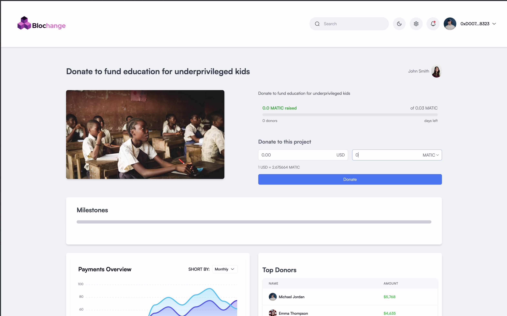

<a id="readme-top"></a>

<!-- PROJECT SHIELDS -->
<!--
*** I'm using markdown "reference style" links for readability.
*** Reference links are enclosed in brackets [ ] instead of parentheses ( ).
*** See the bottom of this document for the declaration of the reference variables
*** for contributors-url, forks-url, etc. This is an optional, concise syntax you may use.
*** https://www.markdownguide.org/basic-syntax/#reference-style-links
-->
[![LinkedIn][linkedin-shield]][linkedin-url]

<!-- PROJECT LOGO -->
<br />
<div align="center">
  <a href="https://github.com/theman-oj10/Blochange">
    
  </a>

<h3 align="center">Trust. Track. Transform.</h3>

  <p align="center">
    Blochange is a blockchain-based platform that ensures transparent, milestone-based fund distribution for charitable organizations. By utilizing immutable records, smart contracts, and donor voting systems, Blochange aims to create a new level of accountability and trust between donors and beneficiaries.
  </p>
</div>

<details>
  <summary>Table of Contents</summary>
  <ol>
    <li>
      <a href="#about-the-project">About The Project</a>
      <ul>
        <li><a href="#built-with">Built With</a></li>
      </ul>
    </li>
    <li>
      <a href="#getting-started">Getting Started</a>
      <ul>
        <li><a href="#prerequisites">Prerequisites</a></li>
        <li><a href="#installation">Installation</a></li>
      </ul>
    </li>
    <li><a href="#usage">Current UI</a></li>
    <li><a href="#roadmap">Roadmap</a></li>
    <li><a href="#license">License</a></li>
    <li><a href="#contact">Contact</a></li>
    <li><a href="#acknowledgments">Acknowledgments</a></li>
  </ol>
</details>

## About The Project

#### How It Works:
- <b>Beneficiaries</b>: Set up a fund for their cause, providing credentials and setting clear, measurable milestones.
- <b>Donors</b>: Choose a cause to support. Once milestones are achieved, beneficiaries submit proof of completion.
- <b>Forum</b>: Donor can discuss the validity and credibility of the proof being provided.
- <b>Voting System</b>: Donors can vote to verify milestone completion or request milestone revisions if unsatisfied.
- <b>Smart Contracts</b>: Automatically release funds once enough favourable votes are received.

#### Key Features
- <b>Smart Contract</b> Donation Pools: Secure and transparent fund management.
- <b>Milestone-Based Fund Releases</b>: Funds are unlocked progressively as project milestones are achieved.
- <b>Evidence of Impact</b>: Beneficiaries must submit evidence of milestone completion, which is then reviewed by donors.
- <b>Donor Voting</b>: Active participation by donors in verifying the completion of milestones and requesting for revisions of milestones.
- <b>Automated Fund Release</b>: Upon successful milestone verification, funds are automatically transferred to beneficiaries.

<p align="right">(<a href="#readme-top">back to top</a>)</p>

### Built With

- [![Next][Next.js]][Next-url]
- [![React][React.js]][React-url]
- [![MongoDB][MongoDB]][MongoDB-url]
- [![TailwindCSS][TailwindCSS]][TailwindCSS-url]
- [![Solidity][Solidity]][Solidity-url]

<p align="right">(<a href="#readme-top">back to top</a>)</p>

<!-- GETTING STARTED -->

## Getting Started

To get a local copy up and running follow these steps.

### Prerequisites

- npm
  ```sh
  npm install npm@latest -g
  ```

### Installation

1. Request for .env file with all the API keys
2. Clone the repo
   ```sh
   git clone https://github.com/theman-oj10/Blochange.git
   ```
3. Install NPM packages
   ```sh
   npm install
   ```
4. Add your .env file to the root folder
5. Change git remote url to avoid accidental pushes to base project
   ```sh
   git remote set-url origin theman-oj10/Blochange
   git remote -v # confirm the changes
   ```

<p align="right">(<a href="#readme-top">back to top</a>)</p>

<!-- USAGE EXAMPLES -->

## Current UI

Our core functionality lies within the Donation details page and the discover page. Here are some screenshots of the UI <br>
<b>Discover/Home Page:</b> <br>
 <br>
<b>Donation Details Page:</b><br>
 <br>
<b>Automatically Generated Receipt:<</b><br>
<br>
<b>Current voting system:</b><br>
<br>
<b>We can use polygonscan to see the live transactions and function calls being made on the blockchain:</b><br>
<br>

<p align="right">(<a href="#readme-top">back to top</a>)</p>

<!-- ROADMAP -->

## Roadmap
- [X] User Interface
- [X] Blockchain Integrations
- [X] Donation System 
- [X] Donor Voting System
- [X] Automated Fund Release
- [X] Invoice Generation
- [ ] Discussion Forum
  - [X] Upload Images and Videos
  - [X] Post Comments
  - [ ] Add threads feature
- [ ] Fiat payment gateway
- [ ] IPFS Integration

See the [open issues](https://github.com/theman-oj10/Blochange/issues) for a full list of proposed features (and known issues).

<p align="right">(<a href="#readme-top">back to top</a>)</p>

<!-- LICENSE -->

## License

Currently not being distributed.

<p align="right">(<a href="#readme-top">back to top</a>)</p>

<!-- CONTACT -->

## Contact

Manoj Narender - manojnarender@gmail.com

Project Link: [https://github.com/theman-oj10/Blochange](https://github.com/theman-oj10/Blochange)

<p align="right">(<a href="#readme-top">back to top</a>)</p>

<!-- ACKNOWLEDGMENTS -->

## Acknowledgments

- Open Source Frontend Components: https://github.com/NextAdminHQ/nextjs-admin-dashboard

<p align="right">(<a href="#readme-top">back to top</a>)</p>


[contributors-shield]: https://img.shields.io/github/contributors/theman-oj10/Blochange.svg?style=for-the-badge
[contributors-url]: https://github.com/theman-oj10/Blochange/graphs/contributors
[forks-shield]: https://img.shields.io/github/forks/theman-oj10/Blochange.svg?style=for-the-badge
[forks-url]: https://github.com/theman-oj10/Blochange/network/members
[stars-shield]: https://img.shields.io/github/stars/theman-oj10/Blochange.svg?style=for-the-badge
[stars-url]: https://github.com/theman-oj10/Blochange/stargazers
[issues-shield]: https://img.shields.io/github/issues/theman-oj10/Blochange.svg?style=for-the-badge
[issues-url]: https://github.com/theman-oj10/Blochange/issues
[license-shield]: https://img.shields.io/github/license/theman-oj10/Blochange.svg?style=for-the-badge
[license-url]: https://github.com/theman-oj10/Blochange/blob/master/LICENSE.txt
[linkedin-shield]: https://img.shields.io/badge/-LinkedIn-black.svg?style=for-the-badge&logo=linkedin&colorB=555
[linkedin-url]: https://www.linkedin.com/in/manoj-narender-99a363228/
[product-screenshot]: images/screenshot.png
[Next.js]: https://img.shields.io/badge/next.js-000000?style=for-the-badge&logo=nextdotjs&logoColor=white
[Next-url]: https://nextjs.org/
[TailwindCSS]: https://img.shields.io/badge/tailwindcss-0F172A?&logo=tailwindcss
[MongoDB]: https://img.shields.io/badge/-MongoDB-13aa52?style=for-the-badge&logo=mongodb&logoColor=white
[React.js]: https://img.shields.io/badge/React-20232A?style=for-the-badge&logo=react&logoColor=61DAFB
[React-url]: https://reactjs.org/
[Solidity]: https://img.shields.io/badge/Solidity-%5E0.8.7-red
[Solidity-url]: https://soliditylang.org/
[MongoDB-url]: https://www.mongodb.com/
[TailwindCSS-url]: https://tailwindcss.com/
